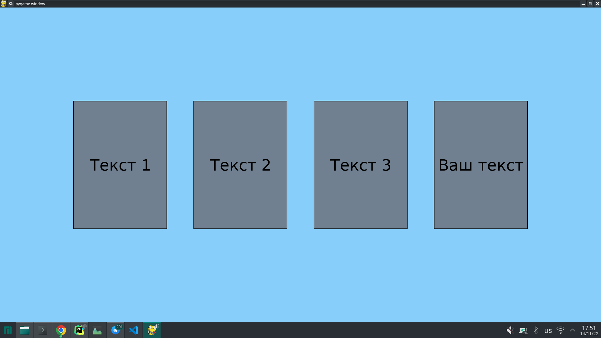
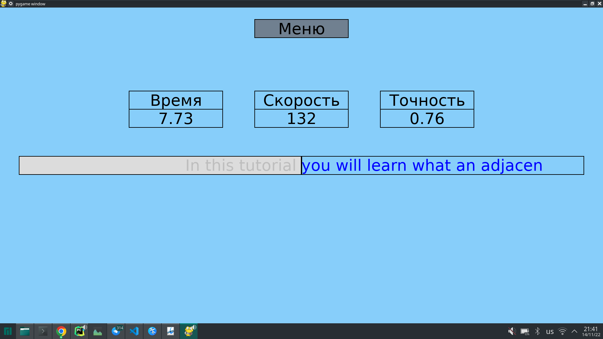

# Python_1st_project

### Тема прокета - Клавиатурный тренажёр

## Установка и запуск

1) установите pygame
   ```console
   pip install pygame==2.1.2
   ```
2) склонируйте и запустите проект
   ```console
   git clone git@github.com:Vadim14032022/Python_1st_project.git
   cd Python_1st_project
   chmod +x app.py
   ./app.py
   ```

## Структура проекта

#### app.py - главный исполняемый файл

TextObject.py - содержит класс для вывода текста на экран\
Button.py - содержит класс кнопки\
TextInput.py - содержит класс для обработки ввода текста\
Windows.py - содержит классы окна меню и окна ввода текста для замера скорости

Папки:\
sources - картинки \
app_texts - встроенные тексты\
user_texts - пользовательские тексты

## Текущая версия

1) есть меню, для выбора текста надо нажать на прямоугольник\
2) можно печатать один из трех текстов с замером времени, скорости, точности(без сохоанения результата),
   для возврата в меню надо нажать на меню



