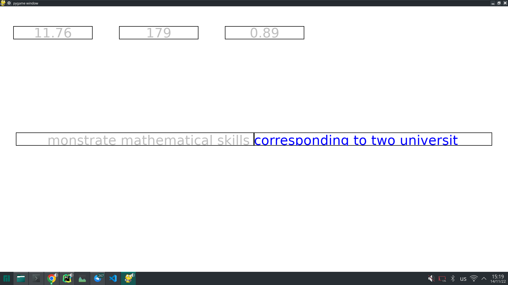

# Python_1st_project

### Тема прокета - Клавиатурный тренажёр

## Инфо

pygame 2.1.2 (SDL 2.0.16, Python 3.10.7)

#### app.py - исполняемый файл

TextObject.py - содержит класс для вывода текста на экран\
Button.py - содержит класс кнопки\
TextInput.py - содержит класс для обработки ввода текста\

Папки:\
sources - картинки \
app_texts - встроенные тексты\
user_texts - пользовательские тексты

## Текущая версия

можно печатать только один текст с замером времени, скорости, точности

